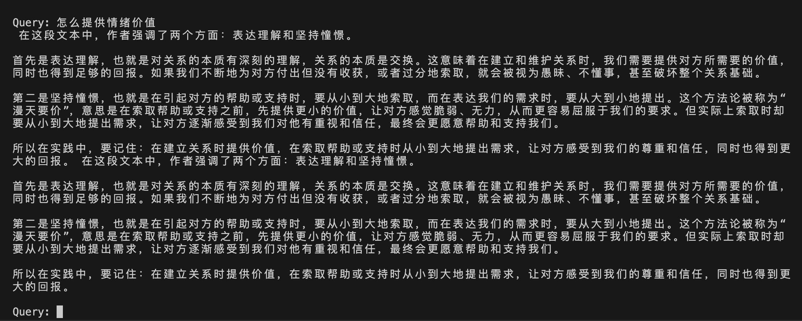
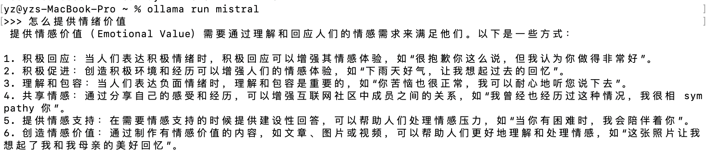

# RAGququ
RAG with langchain, ollama based on QuQu's class audio transcript.

## Install
```sh
pip install -r requirements.txt
ollama run mistral```

## Run
run ```python3 rag.py```

# Result:
### RAG result

### Ollama result
